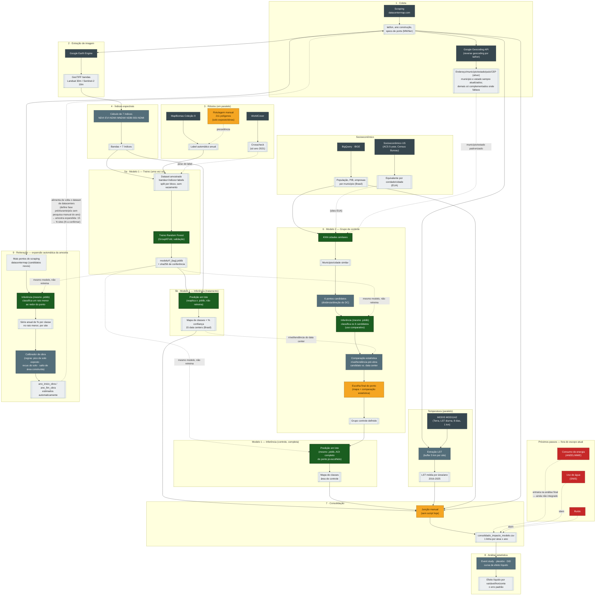

# Pipeline de dados: coletas, armazenamento, modelos e análises

Pipeline de dados do Sentinela Verde: da coleta de data centers e imagens de satélite até a
análise estatística do impacto ambiental e territorial no entorno deles.

## Racional geral

Data centers vêm crescendo rápido no Brasil, em geral perto de áreas urbanas ou periurbanas: cada
um ocupa terreno, consome dezenas de MW e altera o uso do solo ao seu redor. Não existe hoje uma
medição sistemática desse impacto — a pergunta de pesquisa deste projeto é: **a chegada de um data
center muda, de forma mensurável, a cobertura do solo (vegetação, construção, solo exposto) e a
temperatura de superfície ao seu redor — além do que já mudaria de qualquer forma pela tendência
regional?**

Responder isso exige separar o que teria acontecido de qualquer jeito (crescimento urbano natural,
tendência regional) do que é atribuível especificamente ao data center. A estratégia adotada é
comparar cada área tratada (onde um data center foi construído) com uma área de controle (uma
região parecida socioeconomicamente que não recebeu data center), medindo as duas antes e depois
da obra — um desenho de inferência causal observacional (event study / diferença-em-diferenças),
o cabível quando não é possível randomizar quem recebe o "tratamento".

O pipeline existe para produzir, de ponta a ponta, os dados que alimentam essa comparação:

1. localizar data centers reais e um grupo de controle comparável (coleta + filtro de
   elegibilidade + pareamento por similaridade socioeconômica);
2. baixar e classificar imagem de satélite (vegetação densa/rala, solo exposto, área construída,
   água) de cada área, ano a ano, tanto para o data center quanto para seu controle;
3. extrair temperatura de superfície e indicadores socioeconômicos da mesma área;
4. consolidar tudo num painel único (área × ano); e
5. testar estatisticamente se o efeito líquido (tratamento − controle) é diferente de zero, com o
   cuidado de corrigir por múltiplas comparações e validar sem misturar linhas do mesmo evento
   entre treino e teste.

Hoje a amostra é pequena (15 pares tratamento/controle no Brasil) e o resultado honesto, depois da
correção por múltiplas comparações, é que nenhuma variável mostra efeito estatisticamente
significativo ainda — embora a direção de algumas (ex.: área construída) aponte para uma possível
interferência que a amostra atual não tem poder estatístico para confirmar. Esse resultado, suas
limitações e os próximos passos metodológicos estão documentados em
[`projetos/09_analise_estatistica_impacto/`](projetos/09_analise_estatistica_impacto/README.md).

> Os pontos marcados como "⚠ decisão em aberto" na seção de decisões, mais abaixo, ainda não têm
> dono — o resto deste documento já reflete a estrutura em uso.

## Diagrama do pipeline

Fluxo completo — coleta → extração de imagem → rótulos → índices espectrais → Modelo 1
(treino/inferência) → Modelo 2 (grupo de controle) → consolidação → análise estatística →
reiteração/expansão da amostra. [Versão interativa, com zoom](https://claude.ai/code/artifact/0f4cf670-5e55-4495-bb8b-f0ea743d679f);
abaixo, a mesma fonte, renderizada direto pelo GitHub:



> Se editar o diagrama, mude nos dois lugares: aqui (pra renderizar no GitHub) e em
> `diagrama.html` (pra manter zoom/legenda/tabela de etapas funcionando).

## Árvore do repositório

```
sentinela_verde/
│
├── dados/                                  # data lake — bronze/silver/gold
│   ├── bronze/                             # bruto, exatamente como veio da fonte
│   │   ├── datacentermap/                  # scraping (JSON cru, cache incremental) + correção de endereço
│   │   ├── imagens_satelite/               # (AWS S3) — GeoTIFF pesado não fica no git, só o manifest
│   │   │   ├── landsat/
│   │   │   └── sentinel2/
│   │   ├── labels/                         # tifs leves (13 MB), versionados aqui
│   │   │   ├── dynamic_world/              # fonte principal
│   │   │   └── mapbiomas/                  # mantido como alternativa
│   │   ├── temperatura/                    # LST por site x ano + cenas brutas (220 KB, leve)
│   │   ├── footprints_osm/                 # polígonos de prédio do OpenStreetMap (EUA)
│   │   ├── ibge/
│   │   └── socioeconomico_us/              # equivalente ao IBGE pra grupo controle nos EUA
│   │
│   ├── silver/                             # tratado / intermediário
│   │   ├── datacentermap_enderecos_corrigidos.csv  # endereço/município/estado/país/CEP (242/242 OK)
│   │   ├── features/                       # (AWS S3) — 13 bandas, dado derivado pesado
│   │   ├── datacao_obra/                   # série de NDBI, validação e datas derivadas por campus
│   │   ├── expansao_amostra/               # série no raio menor (etapa 7) — ❌ depende do Modelo 1
│   │   └── grupo_controle/                 # 6 candidatos + comparação estatística (etapa 6/6a) + escolha final
│   │
│   ├── gold/                               # pronto pra modelar / analisar
│   │   ├── area_por_classe.csv             # série por site × ano × sensor × classe (rf_v2.0-dw) — ver decisão 5
│   │   ├── dataset_classificacao.parquet   # (AWS S3) — dataset amostrado que alimenta o treino (5a)
│   │   ├── consolidado_impacto_modelo.csv  # ⚠ hoje montado manualmente — etapa 7 do diagrama
│   │   ├── efeito_liquido/                 # saídas do step1/1b/1c: curvas, event study, testes de significância
│   │   ├── efeito_liquido_32dc/            # análise exploratória à parte — ver nota abaixo
│   │   └── powerbi_export/                 # tabelas gold pro dashboard Power BI — ver nota abaixo
│   │
│   ├── labels_manual/                      # 211 polígonos humanos — é INSUMO versionado, não saída
│   └── manifests/                          # 1.066 manifests — proveniência (sha256), sempre commitado
│
├── modelos/
│   ├── modelo_1_classificacao_imagem/
│   │   ├── treino/                         # roda 1x, gera o artefato (etapa 5a)
│   │   ├── inferencia/                     # classifica.py — reaplica o .joblib já treinado (etapas 5b e 6b)
│   │   ├── config/                         # classes.yml, params.yml, sites.geojson
│   │   ├── exemplos/                       # 1 par input/output real, pra conferir a inferência sem rodar o pipeline inteiro
│   │   └── artefatos/                      # (AWS S3) — *.joblib + *.sha256
│   │
│   └── modelo_2_grupo_controle/
│       ├── selecao_candidatos/             # KNN cidade similar (BR ou US) + 6 pontos candidatos
│       ├── comparacao_estatistica/         # chama a inferência do modelo 1 (dependência
│       │                                   # cruzada, ver decisão 2) + compara nível/tendência pré-obra
│       └── artefatos/                      # (AWS S3)
│
├── projetos/                               # 1 pasta por etapa do diagrama, numeradas na mesma ordem
│   ├── 01_coleta_datacenter/               # inclui correcao_endereco/ e filtro_elegibilidade/
│   ├── 02_extracao_imagem/
│   ├── 03_extracao_labels/
│   ├── 04_indices_espectrais/
│   ├── 05_extracao_lst/
│   ├── 06_extracao_socioeconomico/         # ibge/ + socioeconomico_us/
│   ├── 07_reiteracao_expansao_amostra/     # candidatos do scraping, joblib em raio menor, calibrador de obra
│   ├── 08_consolidacao/                    # ver decisão 1
│   └── 09_analise_estatistica_impacto/     # sem o Estágio 2/RF — event study, placebo, DiD, curva efeito líquido
│
├── docs/
│   ├── decisoes/                           # ADRs do time
│   └── tarefas/                            # 1 tarefa por arquivo
│
└── proximos_passos/                        # backlog isolado, fora do pipeline ativo
    ├── energia_aneel_mme/                  # aneel_energia_municipio + bigquery_mme_energia_uf — não conectado ao pipeline ativo
    ├── agua_snis/                          # bigquery_snis_agua — sem dado, nunca foi gerado na fonte
    └── ruido/                              # sem fonte de dado ainda
```

## Análises exploratórias (fora do estudo principal)

Duas coisas neste repositório são investigações à parte do estudo de 15 pares descrito no
racional acima — não substituem o resultado principal, apenas o complementam:

- **`dados/gold/efeito_liquido_32dc/`** (gerado por
  `projetos/09_analise_estatistica_impacto/step_analise_32dc_br_eua.py`) — testa se ampliar a
  amostra para 31 pares (Brasil + EUA, fonte suplementar) melhora a significância estatística.
  Os p-valores melhoram, mas nenhuma variável cruza o limiar de significância após a correção por
  múltiplas comparações — ver seção própria no
  [README da análise estatística](projetos/09_analise_estatistica_impacto/README.md).
- **`dados/gold/powerbi_export/`** (gerado por `export_gold_powerbi.py`, na mesma pasta) — exporta
  o painel dos 15 pares (mais imagens em miniatura) em formato de tabela gold, para alimentar um
  dashboard Power BI — ver [README da pasta](dados/gold/powerbi_export/README.md).

## Decisões em aberto (o time de arquitetura precisa bater o martelo)

### 1 · Quem escreve o `08_consolidacao/`?

Esta é a maior lacuna do pipeline hoje (marcada em âmbar, como etapa manual, no diagrama): não existe
nenhum script que junte classificação (tratamento + controle) + LST + IBGE num painel único — é
feito manualmente. Virar código aqui é o que fecha o pipeline ponta-a-ponta e também é pré-requisito
pra rodar a expansão da amostra (etapa 9) de forma automática, não pontual.

### 2 · Modelo 2 agora depende do Modelo 1 — isso muda a ordem de deploy/versionamento

Com a comparação estatística dos 6 candidatos (etapa 6a do diagrama) e a expansão automática da
amostra (etapa 9), `modelo_2_grupo_controle/` e `projetos/07_reiteracao_expansao_amostra/` passam a
**chamar o `.joblib` do Modelo 1** diretamente — não são mais dois modelos independentes que só se
encontram no painel consolidado. Isso tem duas implicações pra arquitetura: (1) uma mudança no
Modelo 1 (novo treino, novo `tag`) pode invalidar resultados do Modelo 2 já gerados, então vale
registrar no manifest do Modelo 2 **qual `sha256` do `.joblib`** foi usado; (2) o pacote/serviço que
expõe a inferência do Modelo 1 precisa ser importável tanto por quem roda a classificação direta
(etapas 5b/6b) quanto por quem roda a seleção de controle (6a) e a expansão (9) — ou seja, a
inferência não pode ficar "presa" dentro do projeto do Modelo 1 sem uma forma de reuso.

### 3 · Fonte de dado socioeconômico dos EUA ainda não existe

`socioeconomico_us/` está na árvore como placeholder — nenhuma extração equivalente ao IBGE para
municípios/condados americanos foi encontrada no código hoje. Antes de implementar
`modelos/modelo_2_grupo_controle/` para sites nos EUA, alguém precisa decidir a fonte (Census
Bureau ACS? BLS? outra?) — isso também é pré-requisito de qualquer expansão internacional do
estudo (proposta, ainda não aprovada).

### 4 · Onde mora o dado pesado

Resolvido: os binários pesados (`.joblib`, `.tif`, `.parquet`) ficam na **AWS** (S3), não no git —
marcado com "(AWS S3)" na árvore, em cada pasta onde isso se aplica. Pra imagem já está em
produção: **`.tif` vive só no S3**, no bucket bronze
`plataforma-lakehouse-bronze-149465616406-us-east-1-an`, sob
`raw/imagens_satelite/{sensor}/site_id=<id>/ano=<ano>/<ano>.tif` (particionamento Hive, pra Glue/
Athena enxergarem as partições). O **manifest é leve e fica versionado** em `dados/manifests/`,
além de espelhado no S3 — é ele que liga o commit ao arquivo remoto, via `sha256`.

Regra geral que saiu daqui, e que vale pras próximas etapas: *output leve vai pro git **e** pro
S3; output pesado vai só pro S3.*

### 5 · O CSV publicado sai de um classificador que o projeto reprovou ⚠

Correção de um registro anterior: esta decisão dizia que "qual classificação é a de produção"
estava em aberto. **Não está** — o critério existe, está escrito desde antes de haver número, e
foi medido. O `manifest.json` que acompanha os artefatos no S3 e o **ADR-006 §8** registram:

> produção é o **`rf_v1.0-tuned`**, e o critério de adoção deste projeto **não é acurácia, é
> estabilidade temporal**: um retreino só substitui o modelo atual se ficar abaixo da
> instabilidade do próprio rótulo que o treinou.

O `rf_v2.0-dw` ganha em acurácia com folga — macro-F1 0,828 contra 0,776, e a classe 3
(`solo_exposto_obras`) salta de F1 0,580 para 0,804, o maior ganho isolado do projeto, porque o
Dynamic World tem `bare` nativa onde o MapBiomas não tinha canteiro de obras. E ainda assim
reprova, nos mesmos pixels e nos mesmos 58 pares de anos:

| instrumento | instabilidade temporal |
|---|---:|
| `dynamic_world` (a barra) | **7,21%** |
| `rf_v2.0-dw` | 13,09% |
| `rf_v1.0-tuned` | 17,54% |

O retreino melhora 25% nesse eixo e continua 1,8× acima da barra. A hipótese registrada lá é que
estabilidade vem de **contexto espacial** — o Dynamic World é uma rede convolucional, e o nosso é
um Random Forest por pixel, sem vizinhança nenhuma. Se estiver certa, nenhum retreino com a mesma
arquitetura passa.

**O problema que isso cria aqui.** O `dados/gold/area_por_classe.csv` publicado neste repositório
é do **`rf_v2.0-dw`** — o modelo reprovado. A escolha foi coerente com o Dynamic World ser a fonte
de rótulo ativa desde 2026-09-11, mas cria uma divergência real com o resto do projeto: toda a
análise de impacto publicada (o achado de 18/20 pares, p=0,0002, o placebo, os testes de robustez)
foi calculada com o `rf_v1.0-tuned`. E é sob o v2.0-dw que o achado **não replica** — 9/14,
p=0,21, contra 14/14, p=0,0001.

Três saídas, e a escolha é do time:

1. **Republicar o CSV a partir do `rf_v1.0-tuned`**, alinhando com o que a análise usou. O
   exportador já aceita `--token`, então é uma execução — mas o fator de correção de sensor teria
   de ser o do v1.0 (ele existe, é o arquivo histórico), e a classe 3 volta a não ser corrigível.
2. **Manter o v2.0-dw e assumir a divergência**, documentando que o CSV de indicadores e a análise
   de impacto falam de classificações diferentes.
3. **Publicar os dois** e deixar a comparação explícita — é a mais cara e a que mais informa, já
   que a diferença entre eles é um resultado do projeto.

Enquanto não se decide, vale a regra que o código já impõe: o fator de correção de sensor é
calibrado sobre uma classificação e o exportador falha se aplicá-lo a outra (ver
`modelos/modelo_1_classificacao_imagem/indicadores/relatorios/`).

No CSV, `tipo` é `tratamento` em toda linha e `pareado_com` está vazio: o grupo de controle ainda
não existe. É a etapa 6a que preenche essas duas colunas.
