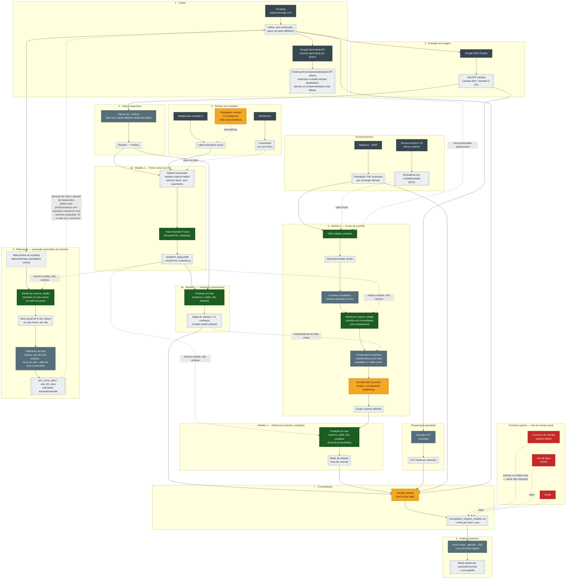

# Estrutura de pastas — dados, modelos e projetos

Estrutura oficial do pipeline do Sentinela Verde, organizada por **dados / modelos / projetos**,
substituindo os **3 repositórios** que existiam antes (`data-extraction`, `modelo-imagens-satelite`
e o protótipo abandonado `datacenter-extracao-modelos`), cada um com sua própria convenção de
pastas. O [diagrama de pipeline](diagrama.html) (interativo, com zoom) e a versão em Mermaid logo
abaixo mostram o fluxo completo de ponta a ponta.

> Os pontos marcados como "⚠ decisão em aberto" na seção de decisões, mais abaixo, ainda não têm
> dono — o resto deste documento já reflete a estrutura em uso.

## Diagrama do pipeline

Fluxo completo — coleta → extração de imagem → rótulos → índices espectrais → Modelo 1
(treino/inferência) → Modelo 2 (grupo de controle) → consolidação → análise estatística →
reiteração/expansão da amostra. Versão interativa com zoom em [`diagrama.html`](diagrama.html);
esta é a mesma fonte, renderizada direto pelo GitHub:



> Se editar o diagrama, mude nos dois lugares: aqui (pra renderizar no GitHub) e em
> `diagrama.html` (pra manter zoom/legenda/tabela de etapas funcionando).

## Status da migração

Migração incremental: o código e o dado de cada fonte estão sendo trazidos pra cá aos poucos,
antes de reconectar o pipeline como um todo — ver `## De-para` para o destino de cada peça.

- [x] **01 · Coleta datacenter** — código de `data-extraction/extract/scraping_datacentermap/`
      copiado para `projetos/01_coleta_datacenter/`; dado bruto (cache JSON + CSV final) copiado
      de `data-extraction/data/raw/datacentermap/` e `outputs_extraction/datacentermap_datacenters.csv`
      para `dados/bronze/datacentermap/`. **Ainda não integrado ao resto do pipeline nesta pasta.**
      Sub-etapa `correcao_endereco/` (`step7_corrige_endereco.py`) — reverse geocoding via Google
      Geocoding API a partir de lat/lon, gera `dados/silver/datacentermap_enderecos_corrigidos.csv`.
      `município`/`estado` sempre atualizados pela API; `endereco`/`cep`/`pais` só complementados
      onde o scraping deixou vazio. **Executado — 242/242 linhas com `status_geocode = OK`.**
- [x] **02 · Extração de imagem** — código de `modelo-imagens-satelite/src/sentinela/gee/`
      (`auth`, `harmonizacao`, `sentinel2`, `landsat`) para `projetos/02_extracao_imagem/`.
      Os 286 GeoTIFF (1,03 GB) foram para o **S3 bronze**, não pro git; os 286 manifests de
      proveniência (sha256 + grade) estão versionados em `dados/manifests/`. Ver decisões 8 e 9.
- [x] **03 · Extração de labels** — código de `src/sentinela/gee/labels.py` + `classes.py` para
      `projetos/03_extracao_labels/`, com **Dynamic World como fonte principal** e MapBiomas
      mantido como alternativa (trocar é editar uma chave em `parametros/params.yml`). Os 494 tifs
      de rótulo são leves (13 MB) e estão versionados em `dados/bronze/labels/`. O WorldCover
      **não veio** — ver decisão 10.
- [x] **04 · Índices espectrais** — código de `src/sentinela/features/indices.py` para
      `projetos/04_indices_espectrais/`. Roda 100% local (sem Earth Engine) e gera 13 bandas
      (6 harmonizadas + 7 índices). Saída vai para **silver**, não bronze — é dado derivado:
      2,9 GB só no S3 silver, com os 286 manifests versionados aqui.
- [ ] 05 · Extração LST
- [x] **06 · Extração socioeconômico** — só a parte IBGE: código de `extract/bigquery_ibge/`
      copiado para `projetos/06_extracao_socioeconomico/ibge/`; dado (`ibge_municipios.csv`)
      copiado para `dados/bronze/ibge/`. **US ainda pendente** (`socioeconomico_us/` continua vazio).
- [ ] Modelo 1 — treino/inferência
- [x] **Modelo 2 — grupo de controle (só seleção de candidatos)** — código de
      `modeling/modelo_grupo_controle/` copiado para
      `modelos/modelo_2_grupo_controle/selecao_candidatos/`; dados (cidades similares, 6 pontos,
      mapa) copiados para `dados/silver/grupo_controle/`. **`comparacao_estatistica/` continua
      vazio** — esse código ainda não existe em nenhum repositório hoje (ver decisão 4).
- [ ] 07 · Reiteração / expansão da amostra
- [ ] 08 · Consolidação — **código continua inexistente** (ver decisão 3); só o dado final
      (`consolidado_impacto_modelo.csv`, hoje montado manualmente) foi copiado pra
      `dados/gold/`, junto com a migração da análise estatística abaixo
- [x] **09 · Análise estatística de impacto** — código de `modeling/modelo_impacto/` copiado
      para `projetos/09_analise_estatistica_impacto/`, **excluindo deliberadamente
      `step2_estagio2_modelo_efeito.py`** (o modelo de Estágio 2/Random Forest não faz parte
      deste escopo); dados (`consolidado_impacto_modelo.csv`, curva de efeito líquido, event
      study, relatório HTML) copiados para `dados/gold/`

## Árvore do repositório

```
sentinela_verde/
│
├── dados/                                  # data lake — 1 convenção única (ver decisão 1)
│   ├── bronze/                             # bruto, exatamente como veio da fonte
│   │   ├── datacentermap/                  # ✅ scraping (JSON cru, cache incremental) — já puxado
│   │   ├── imagens_satelite/               # ✅ código puxado — .tif só no S3 (ver decisão 9)
│   │   │   ├── landsat/
│   │   │   └── sentinel2/
│   │   ├── labels/                          # ✅ já puxado (tifs leves, versionados aqui)
│   │   │   ├── dynamic_world/               # fonte principal desde 2026-09-11
│   │   │   └── mapbiomas/                   # mantido como alternativa
│   │   │                                    # (worldcover removido — ver decisão 10)
│   │   ├── ibge/                           # ✅ já puxado
│   │   └── socioeconomico_us/              # equivalente ao IBGE, para grupo controle nos EUA (⚠ fonte a definir)
│   │
│   ├── silver/                             # tratado / intermediário
│   │   ├── datacentermap_enderecos_corrigidos.csv  # ✅ gerado (etapa 1 · correcao_endereco) — 242/242 OK
│   │   ├── features/                       # ✅ código puxado — 13 bandas, .tif só no S3 silver
│   │   ├── expansao_amostra/               # série no raio menor + calibrador de obra (etapa 9)
│   │   └── grupo_controle/                 # 6 candidatos + comparação estatística (etapa 6/6a) + escolha final
│   │
│   ├── gold/                               # pronto pra modelar / analisar
│   │   ├── dataset_classificacao.parquet   # dataset amostrado que alimenta o treino (5a)
│   │   ├── consolidado_impacto_modelo.csv  # ⚠ hoje montado manualmente — etapa 7 do diagrama
│   │   └── efeito_liquido/                 # saídas do step1: curvas, event study, CSVs
│   │
│   ├── labels_manual/                      # 211 polígonos humanos — é INSUMO versionado, não saída
│   └── manifests/                          # ✅ 1.066 manifests — proveniência (sha256), commitado
│
├── modelos/
│   ├── modelo_1_classificacao_imagem/
│   │   ├── treino/                         # sentinela.train — roda 1x, gera o artefato (etapa 5a)
│   │   ├── inferencia/                     # sentinela.predict — reaplica (etapas 5b e 6b)
│   │   ├── config/                         # classes.yml, params.yml, sites.geojson
│   │   └── artefatos/                      # *.joblib + *.sha256 (binário — ver decisão 2)
│   │
│   └── modelo_2_grupo_controle/
│       ├── selecao_candidatos/             # ✅ já puxado — KNN cidade similar (BR ou US) + 6 pontos candidatos
│       ├── comparacao_estatistica/         # chama a inferência do modelo 1 (dependência
│       │                                   # cruzada, ver decisão 4) + compara nível/tendência pré-obra
│       └── artefatos/
│
├── projetos/                               # 1 pasta por etapa do diagrama, numeradas na mesma ordem
│   ├── 01_coleta_datacenter/               # ✅ código já puxado (+ correcao_endereco/, novo)
│   ├── 02_extracao_imagem/                 # ✅ código já puxado
│   ├── 03_extracao_labels/                 # ✅ código já puxado
│   ├── 04_indices_espectrais/              # ✅ código já puxado
│   ├── 05_extracao_lst/
│   ├── 06_extracao_socioeconomico/         # ibge/ (Brasil) ✅ | socioeconomico_us/ (⚠ fonte a definir)
│   ├── 07_reiteracao_expansao_amostra/     # candidatos do scraping, joblib em raio menor, calibrador de obra
│   ├── 08_consolidacao/                    # ⚠ não existe hoje — ver decisão 3
│   └── 09_analise_estatistica_impacto/     # ✅ já puxado (sem o Estágio 2/RF) — event study, placebo, DiD, curva efeito líquido
│
├── docs/
│   ├── decisoes/                           # ADRs (ex.: status de propostas como Dynamic World)
│   ├── tarefas/                            # 1 tarefa por arquivo
│   └── guia_estrutura_dados.md
│
└── proximos_passos/                        # backlog isolado, fora do pipeline ativo
    ├── energia_aneel_mme/                  # ✅ código + dado puxados (aneel_energia_municipio + bigquery_mme_energia_uf), não conectado
    ├── agua_snis/                          # ✅ código puxado (bigquery_snis_agua); sem dado — nunca foi gerado na fonte
    └── ruido/                              # sem fonte de dado ainda
```

## De-para com o que existe hoje

| Repositório atual | Pasta/arquivo atual | Vai para |
|---|---|---|
| `data-extraction` | `extract/scraping_datacentermap/` | ✅ `projetos/01_coleta_datacenter/` |
| `data-extraction` | `data/raw/datacentermap/` + `data/raw/outputs_extraction/datacentermap_datacenters.csv` | ✅ `dados/bronze/datacentermap/` |
| `modelo-imagens-satelite` | `src/sentinela/gee/{auth,harmonizacao,sentinel2,landsat}.py` | ✅ `projetos/02_extracao_imagem/` |
| `modelo-imagens-satelite` | `src/sentinela/gee/labels.py` + `classes.py` | ✅ `projetos/03_extracao_labels/` |
| `modelo-imagens-satelite` | `src/sentinela/features/indices.py` | ✅ `projetos/04_indices_espectrais/` |
| `data-extraction` | `extract/imagens_satelite/`, `modeling/modelo_classifica_imagem/{labels_mapbiomas,indices}.py` | ~~02 / 03 / 04~~ — não migra, ver decisão 8 |
| `data-extraction` | `modeling/modelo_classifica_imagem/{classification,step2_classificacao_imagens}.py` | ❌ não será trazido — ver decisão 6 |
| `modelo-imagens-satelite` | `src/sentinela/{dataset,train}.py` | `modelos/modelo_1_classificacao_imagem/treino/` |
| `modelo-imagens-satelite` | `src/sentinela/predict.py` | `modelos/modelo_1_classificacao_imagem/inferencia/` |
| `data-extraction` | `modeling/modelo_classifica_imagem/{classification_obra,deteccao_fases_obra}*.py` | `projetos/07_reiteracao_expansao_amostra/` |
| `data-extraction` | `transform/pega_endereco/` (readaptado p/ ler `datacentermap_datacenters.csv`) | ✅ `projetos/01_coleta_datacenter/correcao_endereco/` (executado, 242/242 OK) |
| `data-extraction` | `transform/filtra_datacenter/` | sem pasta designada — ver decisão 7 |
| `data-extraction` | `extract/bigquery_ibge/` | ✅ `projetos/06_extracao_socioeconomico/ibge/` |
| — | *(não existe ainda)* | `projetos/06_extracao_socioeconomico/socioeconomico_us/` — precisa de fonte equivalente ao IBGE pros EUA |
| `data-extraction` | `modeling/modelo_grupo_controle/` | ✅ `modelos/modelo_2_grupo_controle/selecao_candidatos/` |
| — | *(não existe ainda)* | `modelos/modelo_2_grupo_controle/comparacao_estatistica/` — reaplica o `.joblib` do modelo 1 nos 6 candidatos e compara nível/tendência com o data center |
| `data-extraction` | `modeling/modelo_impacto/step1_*.py` (sem step2) | ✅ `projetos/09_analise_estatistica_impacto/` |
| `data-extraction` | `data/silver/consolidado_impacto_modelo.csv` + `data/gold/modelo_impacto/{curva_efeito_liquido,efeito_liquido_por_par}.csv` etc. | ✅ `dados/gold/` |
| `data-extraction` | `data/{bronze,silver,gold}/` | `dados/{bronze,silver,gold}/` (já usa essa convenção) |
| `modelo-imagens-satelite` | `config/`, `models/*.joblib` | `modelos/modelo_1_classificacao_imagem/{config,artefatos}/` |
| `modelo-imagens-satelite` | `data/{raw,interim,processed}/` | `dados/{bronze,silver,gold}/` (precisa migrar convenção) |
| `modelo-imagens-satelite` | `data/labels_manual/`, `data/manifests/` | `dados/{labels_manual,manifests}/` (sem mudança) |
| `modelo-imagens-satelite` | `scripts/nucleo_datacenter_por_ano.py`, `datar_obra_por_serie.py` | `projetos/07_reiteracao_expansao_amostra/` — ⚠ hoje esses scripts só reaproveitam classificação já feita (raio 500m sobre os 15 sites); o fluxo alvo (rodar o `.joblib` direto num raio menor para pontos *novos* do scraping) precisa de um caminho de inferência que ainda não existe |
| `modelo-imagens-satelite` | `docs/decisoes/`, `docs/tarefas/` | `docs/{decisoes,tarefas}/` (sem mudança) |
| `data-extraction` | `extract/aneel_energia_municipio/`, `bigquery_mme_energia_uf/`, `bigquery_snis_agua/` | ✅ `proximos_passos/{energia_aneel_mme,agua_snis}/` |
| `datacenter-extracao-modelos` | (protótipo abandonado, working tree já apagado) | não migra — decidir se arquiva o repo ou apaga de vez |

## Decisões em aberto (o time de arquitetura precisa bater o martelo)

### 1 · Uma convenção única de data lake: `bronze/silver/gold` ou `raw/interim/processed`?

Hoje os dois nomes convivem: `data-extraction` usa bronze/silver/gold (linguagem clássica de
engenharia de dados); `modelo-imagens-satelite` usa raw/interim/processed (convenção comum em
projetos de ML, tipo cookiecutter-data-science). Nenhum dos dois está errado — mas ter os dois no
mesmo pipeline obriga quem lê o código a lembrar qual repo usa qual nome. **Proposta**: padronizar
em `bronze/silver/gold`, porque já é o nome usado na camada final (a que o time de negócio/banca
mais vê, em `modeling/modelo_impacto`) — mas a decisão final é do time.

### 2 · Onde ficam os artefatos binários (`.joblib`, `.tif`, `.parquet`)?

Hoje são gitignored nos dois repos (por bom motivo — são pesados). Numa estrutura única, vale
decidir: ficam fora do controle de versão mesmo (com um manifest de proveniência apontando pra
onde buscar, como já é feito hoje), ou passam a usar algo como Git LFS / bucket S3 versionado? Isso
importa principalmente pro artefato do Modelo 1 (`rf_{tag}.joblib`) — é o "produto" mais crítico de
reproduzir.

### 3 · Quem escreve o `08_consolidacao/`?

Esta é a maior lacuna do pipeline hoje (marcada em âmbar, como etapa manual, no diagrama): não existe
nenhum script que junte classificação (tratamento + controle) + LST + IBGE num painel único — é
feito manualmente. Virar código aqui é o que fecha o pipeline ponta-a-ponta e também é pré-requisito
pra rodar a expansão da amostra (etapa 9) de forma automática, não pontual.

### 4 · Modelo 2 agora depende do Modelo 1 — isso muda a ordem de deploy/versionamento

Com a comparação estatística dos 6 candidatos (etapa 6a do diagrama) e a expansão automática da
amostra (etapa 9), `modelo_2_grupo_controle/` e `projetos/07_reiteracao_expansao_amostra/` passam a
**chamar o `.joblib` do Modelo 1** diretamente — não são mais dois modelos independentes que só se
encontram no painel consolidado. Isso tem duas implicações pra arquitetura: (1) uma mudança no
Modelo 1 (novo treino, novo `tag`) pode invalidar resultados do Modelo 2 já gerados, então vale
registrar no manifest do Modelo 2 **qual `sha256` do `.joblib`** foi usado; (2) o pacote/serviço que
expõe a inferência do Modelo 1 precisa ser importável tanto por quem roda a classificação direta
(etapas 5b/6b) quanto por quem roda a seleção de controle (6a) e a expansão (9) — ou seja, a
inferência não pode ficar "presa" dentro do projeto do Modelo 1 sem uma forma de reuso.

### 5 · Fonte de dado socioeconômico dos EUA ainda não existe

`socioeconomico_us/` está na árvore como placeholder — nenhuma extração equivalente ao IBGE para
municípios/condados americanos foi encontrada no código hoje. Antes de implementar
`modelos/modelo_2_grupo_controle/` para sites nos EUA, alguém precisa decidir a fonte (Census
Bureau ACS? BLS? outra?) — isso também é pré-requisito da expansão internacional mencionada no
ADR-006 do `modelo-imagens-satelite` (hoje proposta, não aprovada).

### 6 · Duas implementações de Modelo 1 encontradas — só uma entra na estrutura

Existem duas implementações de classificação de imagem: a de `modelo-imagens-satelite/src/sentinela`
(MapBiomas, Random Forest) e uma outra em `data-extraction/modeling/modelo_classifica_imagem`
(WorldCover, Random Forest + rede neural Keras). **Decisão: `modelo_1_v2_worldcover` não entra
na estrutura** — `modelos/modelo_1_classificacao_imagem/` continua sendo só a implementação de
`modelo-imagens-satelite`.

A parte de `modelo_classifica_imagem` que decide a fase de obra (`classification_obra.py` +
`deteccao_fases_obra*.py`) continua relevante e mapeada em `projetos/07_reiteracao_expansao_amostra/`
(ver De-para) — é código de detecção de fase, não do classificador de cobertura do solo em si, então
essa exclusão não leva ele junto.

### 7 · `transform/filtra_datacenter` — ainda sem pasta designada (`pega_endereco` ✅ resolvido)

`transform/pega_endereco` foi resolvido: virou
`projetos/01_coleta_datacenter/correcao_endereco/` (sub-etapa que roda depois do scraping,
descrita no checklist acima) — readaptado pra ler `datacentermap_datacenters.csv` direto, em vez
de `lista_mestra_campi.csv` do `modelo-imagens-satelite`.

`transform/filtra_datacenter` continua sem lugar — resolve a dependência que falta pro Modelo 2
rodar (`datacenter_filtrado.csv`), e o candidato natural é outra subpasta de
`projetos/01_coleta_datacenter/` (ex.: `filtro_elegibilidade/`), pelo mesmo raciocínio: fica entre
a coleta bruta e tudo que consome a lista filtrada.

### 8 · Qual extração de imagem é a boa — e o que fazer com a outra ✅ decidido

Existiam **duas** implementações da etapa 2, e o de-para original apontava para a errada.
`data-extraction/extract/imagens_satelite/` puxa Sentinel-2 sem harmonização multissensor, trata
Landsat em scripts avulsos duplicados (`extraction_landsat.py` + `_300m.py`, três conversores
tif→jpg) e não tem teste nenhum. `modelo-imagens-satelite/src/sentinela/gee/` é o que o diagrama
descreve: Landsat 30 m e Sentinel-2 10 m harmonizados na **mesma grade** (origem determinística,
a de 10 m é refinamento exato da de 30 m), com manifest de proveniência por arquivo.

Migrada a segunda. Falta decidir o destino da primeira: ela ainda é o código que gerou parte do
que está em `data-extraction/data/raw/` — arquivar o repo ou só marcar a pasta como morta?

### 9 · Onde mora o dado pesado ⚠ parcialmente resolvido

A decisão 2 (artefatos binários) continua aberta pro `.joblib`, mas para imagem já tem resposta
em produção: **`.tif` vive só no S3**, no bucket bronze
`plataforma-lakehouse-bronze-149465616406-us-east-1-an`, sob
`raw/imagens_satelite/{sensor}/site_id=<id>/ano=<ano>/<ano>.tif` (particionamento Hive, pra Glue/
Athena enxergarem as partições). O **manifest é leve e fica versionado** em `dados/manifests/`,
além de espelhado no S3 — é ele que liga o commit ao arquivo remoto, via `sha256`.

Regra geral que saiu daqui, e que vale pras próximas etapas: *output leve vai pro git **e** pro
S3; output pesado vai só pro S3.*

### 10 · O WorldCover saiu do pipeline ✅ decidido

O ESA WorldCover entrou no desenho como **verificação cruzada** do MapBiomas: só em 2021 (único
ano de sobreposição real), gerando um raster de concordância que a etapa de dataset usava para
ponderar amostra (`peso_label = 1/(1+distancia_safra) × (1,0 se concorda, senão 0,5)`).

Na migração da etapa 3 descobrimos que ele **já estava inerte**. O bloco que gera a concordância é
guardado por `if fonte_principal != "dynamic_world"` — e a fonte principal virou Dynamic World em
2026-09-11. Os números confirmam: dos 494 manifests de rótulo, só **32** têm `crosscheck`
preenchido, todos da era MapBiomas; sob o DW são zero. O DW é anual nativo, não tem safra
defasada, então nem `distancia_safra` nem crosscheck têm o que fazer — os dois fatores do peso
valem 1.

Por isso o WorldCover não foi migrado: nem o código, nem as chaves de `params.yml`, nem o remap em
`classes.yml`, nem os 32 rasters de concordância. Trazer de volta só faz sentido junto com uma
volta para o MapBiomas — e nesse caso a etapa 3 seria reexecutada de qualquer forma, regerando os
manifests. Os 32 manifests antigos ficam versionados como estão, com o campo `crosscheck`
apontando para um `.tif` que não existe neste repo: são registro do que rodou lá atrás, não
entrada de nada aqui.

## Por que separar `treino/` de `inferencia/` dentro do Modelo 1

Reflete a distinção que ajustamos no diagrama: **treino roda uma vez e é caro** (gera o `.joblib`);
**inferência é barata e reaplicada várias vezes** (tratamento, controle, e potencialmente novos
sites conforme a amostra cresce). Separar as pastas deixa claro pra quem chega no repo que rodar
`inferencia/` no dia a dia é normal, mas rodar `treino/` de novo é uma decisão consciente (novo
dataset, novo experimento) — não algo que acontece a cada execução do pipeline.
