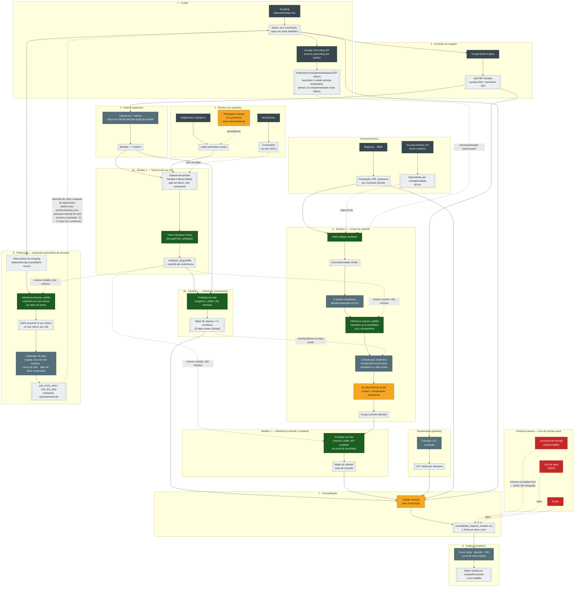

# Pipeline de dados: coletas, armazenamento, modelos e análises

Pipeline de dados do Sentinela Verde: da coleta de data centers e imagens de satélite até a
análise estatística do impacto ambiental e territorial no entorno deles. Organiza, numa estrutura
única (**dados / modelos / projetos**), o que antes estava espalhado em **3 repositórios**
(`data-extraction`, `modelo-imagens-satelite` e o protótipo abandonado
`datacenter-extracao-modelos`), cada um com sua própria convenção de pastas.

> Os pontos marcados como "⚠ decisão em aberto" na seção de decisões, mais abaixo, ainda não têm
> dono — o resto deste documento já reflete a estrutura em uso.

## Diagrama do pipeline

Fluxo completo — coleta → extração de imagem → rótulos → índices espectrais → Modelo 1
(treino/inferência) → Modelo 2 (grupo de controle) → consolidação → análise estatística →
reiteração/expansão da amostra. [Versão interativa, com zoom](https://claude.ai/code/artifact/0f4cf670-5e55-4495-bb8b-f0ea743d679f);
abaixo, a mesma fonte, renderizada direto pelo GitHub:



> Se editar o diagrama, mude nos dois lugares: aqui (pra renderizar no GitHub) e em
> `diagrama.html` (pra manter zoom/legenda/tabela de etapas funcionando).

## Árvore do repositório

❌ = ainda falta migrar (ou não existe código em nenhum repositório hoje):

- ❌ 05 · Extração LST
- ❌ `socioeconomico_us/` (dado + fonte a definir)
- ❌ Modelo 1 — treino/inferência (código ainda não migrado pra cá)
- ❌ `modelo_2_grupo_controle/comparacao_estatistica/` (código não existe em nenhum repositório hoje)
- ❌ 07 · Reiteração / expansão da amostra
- ❌ 08 · Consolidação (código não existe — ver decisões)

```
sentinela_verde/
│
├── dados/                                  # data lake — bronze/silver/gold
│   ├── bronze/                             # bruto, exatamente como veio da fonte
│   │   ├── datacentermap/                  # scraping (JSON cru, cache incremental) + correção de endereço
│   │   ├── imagens_satelite/               # (AWS S3) — GeoTIFF pesado não fica no git, só o manifest
│   │   │   ├── landsat/
│   │   │   └── sentinel2/
│   │   ├── labels/                         # tifs leves (13 MB), versionados aqui
│   │   │   ├── dynamic_world/              # fonte principal
│   │   │   └── mapbiomas/                  # mantido como alternativa
│   │   ├── ibge/
│   │   └── socioeconomico_us/              # ❌ falta migrar — equivalente ao IBGE pra grupo controle nos EUA, fonte a definir
│   │
│   ├── silver/                             # tratado / intermediário
│   │   ├── datacentermap_enderecos_corrigidos.csv  # endereço/município/estado/país/CEP (242/242 OK)
│   │   ├── features/                       # (AWS S3) — 13 bandas, dado derivado pesado
│   │   ├── expansao_amostra/               # série no raio menor + calibrador de obra (etapa 9)
│   │   └── grupo_controle/                 # 6 candidatos + comparação estatística (etapa 6/6a) + escolha final
│   │
│   ├── gold/                               # pronto pra modelar / analisar
│   │   ├── area_por_classe.csv             # série por site × ano × sensor × classe (rf_v2.0-dw) — ver decisão 5
│   │   ├── dataset_classificacao.parquet   # (AWS S3) — dataset amostrado que alimenta o treino (5a)
│   │   ├── consolidado_impacto_modelo.csv  # ⚠ hoje montado manualmente — etapa 7 do diagrama
│   │   └── efeito_liquido/                 # saídas do step1: curvas, event study, CSVs
│   │
│   ├── labels_manual/                      # 211 polígonos humanos — é INSUMO versionado, não saída
│   └── manifests/                          # 1.066 manifests — proveniência (sha256), sempre commitado
│
├── modelos/
│   ├── modelo_1_classificacao_imagem/      # ❌ treino/inferência ainda não migrados
│   │   ├── indicadores/                    # classificado → dados/gold/area_por_classe.csv;
│   │   │                                   # relatorios/ = validação cruzada de sensores (CSV no git)
│   │   ├── treino/                         # sentinela.train — roda 1x, gera o artefato (etapa 5a)
│   │   ├── inferencia/                     # sentinela.predict — reaplica (etapas 5b e 6b)
│   │   ├── config/                         # classes.yml, params.yml, sites.geojson
│   │   └── artefatos/                      # (AWS S3) — *.joblib + *.sha256
│   │
│   └── modelo_2_grupo_controle/
│       ├── selecao_candidatos/             # KNN cidade similar (BR ou US) + 6 pontos candidatos
│       ├── comparacao_estatistica/         # ❌ falta migrar — chama a inferência do modelo 1 (dependência
│       │                                   # cruzada, ver decisão 2) + compara nível/tendência pré-obra
│       └── artefatos/                      # (AWS S3)
│
├── projetos/                               # 1 pasta por etapa do diagrama, numeradas na mesma ordem
│   ├── 01_coleta_datacenter/               # inclui correcao_endereco/
│   ├── 02_extracao_imagem/                 # inclui relatorios/ (qualidade da ingestão, resíduo da harmonização)
│   ├── 03_extracao_labels/
│   ├── 04_indices_espectrais/
│   ├── 05_extracao_lst/                    # ❌ falta migrar
│   ├── 06_extracao_socioeconomico/         # ibge/ ok | socioeconomico_us/ ❌ falta migrar (fonte a definir)
│   ├── 07_reiteracao_expansao_amostra/     # ❌ falta migrar — candidatos do scraping, joblib em raio menor, calibrador de obra
│   ├── 08_consolidacao/                    # ❌ falta migrar — ver decisão 1
│   └── 09_analise_estatistica_impacto/     # sem o Estágio 2/RF — event study, placebo, DiD, curva efeito líquido
│
├── docs/
│   ├── decisoes/                           # ADRs (ex.: status de propostas como Dynamic World)
│   ├── tarefas/                            # 1 tarefa por arquivo
│   └── guia_estrutura_dados.md
│
└── proximos_passos/                        # backlog isolado, fora do pipeline ativo
    ├── energia_aneel_mme/                  # aneel_energia_municipio + bigquery_mme_energia_uf — não conectado ao pipeline ativo
    ├── agua_snis/                          # bigquery_snis_agua — sem dado, nunca foi gerado na fonte
    └── ruido/                              # sem fonte de dado ainda
```

## Decisões em aberto (o time de arquitetura precisa bater o martelo)

### 1 · Quem escreve o `08_consolidacao/`?

Esta é a maior lacuna do pipeline hoje (marcada em âmbar, como etapa manual, no diagrama): não existe
nenhum script que junte classificação (tratamento + controle) + LST + IBGE num painel único — é
feito manualmente. Virar código aqui é o que fecha o pipeline ponta-a-ponta e também é pré-requisito
pra rodar a expansão da amostra (etapa 9) de forma automática, não pontual.

### 2 · Modelo 2 agora depende do Modelo 1 — isso muda a ordem de deploy/versionamento

Com a comparação estatística dos 6 candidatos (etapa 6a do diagrama) e a expansão automática da
amostra (etapa 9), `modelo_2_grupo_controle/` e `projetos/07_reiteracao_expansao_amostra/` passam a
**chamar o `.joblib` do Modelo 1** diretamente — não são mais dois modelos independentes que só se
encontram no painel consolidado. Isso tem duas implicações pra arquitetura: (1) uma mudança no
Modelo 1 (novo treino, novo `tag`) pode invalidar resultados do Modelo 2 já gerados, então vale
registrar no manifest do Modelo 2 **qual `sha256` do `.joblib`** foi usado; (2) o pacote/serviço que
expõe a inferência do Modelo 1 precisa ser importável tanto por quem roda a classificação direta
(etapas 5b/6b) quanto por quem roda a seleção de controle (6a) e a expansão (9) — ou seja, a
inferência não pode ficar "presa" dentro do projeto do Modelo 1 sem uma forma de reuso.

### 3 · Fonte de dado socioeconômico dos EUA ainda não existe

`socioeconomico_us/` está na árvore como placeholder — nenhuma extração equivalente ao IBGE para
municípios/condados americanos foi encontrada no código hoje. Antes de implementar
`modelos/modelo_2_grupo_controle/` para sites nos EUA, alguém precisa decidir a fonte (Census
Bureau ACS? BLS? outra?) — isso também é pré-requisito da expansão internacional mencionada no
ADR-006 do `modelo-imagens-satelite` (hoje proposta, não aprovada).

### 4 · Onde mora o dado pesado

Resolvido: os binários pesados (`.joblib`, `.tif`, `.parquet`) ficam na **AWS** (S3), não no git —
marcado com "(AWS S3)" na árvore, em cada pasta onde isso se aplica. Pra imagem já está em
produção: **`.tif` vive só no S3**, no bucket bronze
`plataforma-lakehouse-bronze-149465616406-us-east-1-an`, sob
`raw/imagens_satelite/{sensor}/site_id=<id>/ano=<ano>/<ano>.tif` (particionamento Hive, pra Glue/
Athena enxergarem as partições). O **manifest é leve e fica versionado** em `dados/manifests/`,
além de espelhado no S3 — é ele que liga o commit ao arquivo remoto, via `sha256`.

Regra geral que saiu daqui, e que vale pras próximas etapas: *output leve vai pro git **e** pro
S3; output pesado vai só pro S3.*

### 5 · Qual classificação é a de produção — e o fator de sensor calibrado na outra ⚠

`dados/gold/area_por_classe.csv` é o handoff para a comparação estatística (etapa 6a): uma linha
por site × ano × sensor × classe, com `area_m2`, `pct_area_valida`, `fator_correcao_sensor` e a
faixa da série. 1.430 linhas, 16 sites, 2013-2025. Foi gerado do **`rf_v2.0-dw`**, por coerência
com o Dynamic World ser a fonte de rótulo ativa desde 2026-09-11. Daí saem três pontos que
precisam de decisão, não só de registro:

1. **O `rf_v2.0-dw` nunca foi promovido a produção.** A inferência escreve em `classificado/`
   quando é produção e num prefixo versionado (`classificado-rf_v2.0-dw/`) quando é avaliação
   paralela — e esse modelo só existe no prefixo de avaliação. O exportador original tinha o
   prefixo fixo em `classificado_*`, então **não conseguia exportar essa classificação**: ela
   existia no disco e era invisível para ele. A versão migrada ganhou `--token` para escolher o
   prefixo.
2. **É o modelo sob o qual o achado de impacto não replica** (9/14, p=0,21, contra 14/14,
   p=0,0001 do `rf_v1.0-tuned`). A escolha foi deliberada, por coerência com a fonte de rótulo —
   mas a divergência entre os dois é um resultado do projeto, não um detalhe de implementação.
   Para comparação: o `rf_v1.0-tuned` cobre 270 rasters e o `rf_v2.0-dw` cobre 286 (os 16 extras
   são anos Landsat tardios), e a mediana de `solo_exposto_obras` vai de 1,81% para 4,90% — o
   MapBiomas não tem classe de canteiro de obras e o DW tem `bare` nativa.
3. **O fator de correção de sensor foi calibrado sobre o OUTRO modelo.** O
   `fator_correcao_sensor_sv20.json` traz `modelo_versao: rf_v1.0-tuned`, e é ele que preenche a
   coluna `fator_correcao_sensor` das linhas de `construida_urbana` (0,4359 a 1,0977, por site).
   Como as duas classificações não produzem as mesmas áreas, **esse fator não é necessariamente
   válido para o `rf_v2.0-dw`**. Recalibrar exige rodar a validação de sensores sobre os rasters
   do v2.0-dw, o que não foi feito. A evidência do fator está em CSV, legível direto no GitHub:
   `modelos/modelo_1_classificacao_imagem/indicadores/relatorios/`.

No CSV, `tipo` é `tratamento` em toda linha e `pareado_com` está vazio: o grupo de controle ainda
não existe. É a etapa 6a que preenche essas duas colunas.
